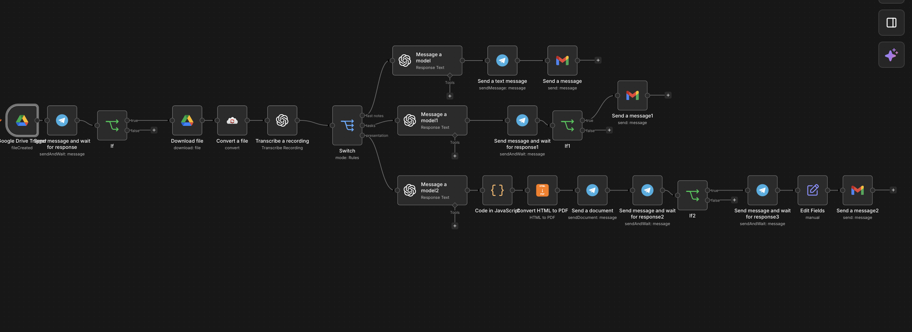

# n8n-post-meeting-automation
# 🎙️ Post-Meeting Automation Workflow (n8n + OpenAI + Telegram + Gmail)

Kompleksowy workflow w n8n automatyzujący proces przetwarzania nagrań wideo/audio ze spotkań biznesowych. System pobiera plik z Google Drive, dokonuje transkrypcji i konwersji, a następnie udostępnia interaktywne menu na Telegramie z wyższym stopniem automatyzacji.

## 🚀 Główne Funkcjonalności

1. **Google Drive & CloudConvert Integration:** Automatyczne wykrywanie nowego nagrania w wybranym folderze oraz konwersja plików wideo do optymalnego formatu audio (`.mp3`).
2. **AI Audio Transcribe:** Przetwarzanie mowy na tekst za pomocą modelu Whisper / OpenAI.
3. **Interaktywne Menu na Telegramie:** Decydowanie "Human-in-the-loop" o ścieżce przetworzenia nagrania:
   - 📝 **Szybkie notatki:** Streszczenie kluczowych ustaleń wysyłane na Telegram & E-mail.
   - ✅ **Zadania (Action Items):** Wyciąganie listy zadań wraz z systemem akceptacji przed wysyłką do zespołu.
   - 📊 **Prezentacja Follow-Up (PDF):** Automatyczna generacja prezentacji HTML/CSS i konwersja do profesjonalnego pliku PDF.
4. **HTML-to-PDF Engine:** Projektowanie dynamicznych slajdów biznesowych w kodzie HTML/CSS zintegrowanych z danymi strukturyzowanymi JSON z OpenAI.
5. **Interactive Email Dispatch:** Zbieranie adresu e-mail klienta przez Telegram i wysyłka dedykowanego maila HTML z załączonym plikiem PDF.

## 🛠️ Technologie i Węzły

- **Automation:** n8n (v1.x)
- **AI Models:** OpenAI API (`gpt-4o-mini`, Audio Transcription)
- **Messaging & HITL:** Telegram Bot API (`sendAndWait`, `sendDocument`)
- **Document Generation:** Custom JavaScript Code (HTML/CSS layout) + `n8n-nodes-htmlcsstopdf`
- **Storage & Mail:** Google Drive API, CloudConvert API, Gmail API

## 📥 Instrukcja Instalacji

1. Pobierz plik workflow z repozytorium (`workflow.json`).
2. W swoim środowisku **n8n** wybierz `Import from File` i wklej zawartość.
3. Podepnij wymagane credentials:
   - OpenAI API Key
   - Telegram Bot Credentials
   - Google Drive & Gmail OAuth2
   - CloudConvert API Key
   - HTML2PDF API Key
4. Aktywuj workflow!
